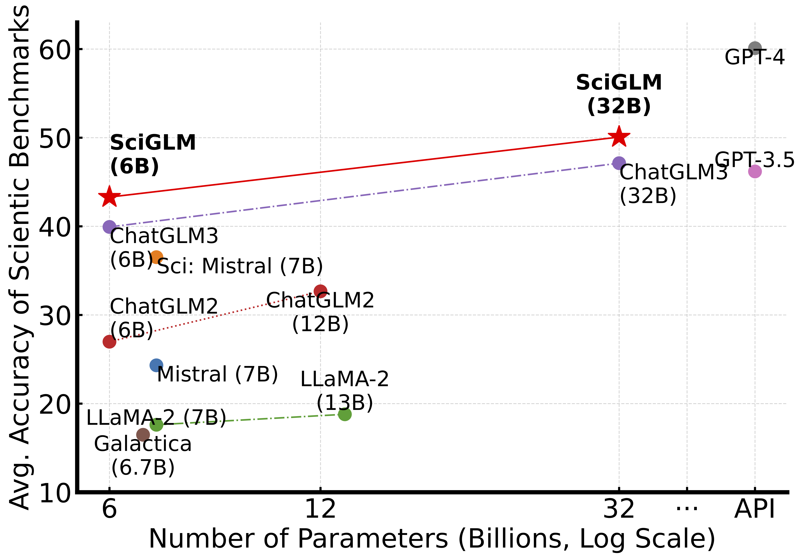

# 📝 Preprints

Arxiv 2024

[RecDCL: Dual Contrastive Learning for Recommendation](https://arxiv.org/pdf/2401.15635.pdf)

- **Dan Zhang**, Ziniu Hu, Sining Zhoubian, Zhengxiao Du, Kaiyu Yang, Zihan Wang, Yisong Yue, Yuxiao Dong, and Jie Tang.

 [**[PDF]**](https://arxiv.org/abs/2401.07950) \| [**[Code&Data]**](https://github.com/THUDM/SciGLM)

<!-- - **Dan Zhang**, Ziniu Hu, Sining Zhoubian, Zhengxiao Du, Kaiyu Yang, Zihan Wang, Yisong Yue, Yuxiao Dong, and Jie Tang. [SciGLM: Training Scientific Language Models with Self-Reflective Instruction Annotation and Tuning](https://arxiv.org/abs/2401.07950), **Arxiv 2024**. [**[PDF]**](https://arxiv.org/abs/2401.07950) [**[Code&Data]**](https://github.com/THUDM/SciGLM) -->